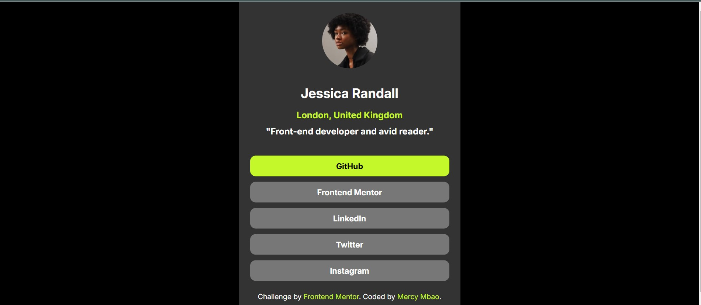

# Frontend Mentor - Social links profile solution

This is a solution to the [Social links profile challenge on Frontend Mentor](https://www.frontendmentor.io/challenges/social-links-profile-UG32l9m6dQ). Frontend Mentor challenges help you improve your coding skills by building realistic projects. 

## Table of contents

- [Overview](#overview)
  - [The challenge](#the-challenge)
  - [Screenshot](#screenshot)
  - [Links](#links)
- [My process](#my-process)
  - [Built with](#built-with)
  - [What I learned](#what-i-learned)
  - [Continued development](#continued-development)
  - [Useful resources](#useful-resources)
- [Author](#author)
- [Acknowledgments](#acknowledgments)

## Overview

### The challenge

Users should be able to:

- See hover and focus states for all interactive elements on the page

### Screenshot

### Links

- Solution URL: https://www.frontendmentor.io/profile/mercie-ux/solutions
- Live Site URL: https://social-links-profile-six-gray.vercel.app/

## My process

### Built with

- Semantic HTML5 markup
- CSS custom properties
- Flexbox
- CSS Grid

### What I learned
positioning the div at the center.
hovering effect using css
how to add active to the heading element using javascript.

### Continued development
I purpose to add animation and transition effect

### Useful resources

- https://www.w3schools.com/howto/tryit.asp?filename=tryhow_js_active_element2 - This helped me for with simplified notes. I really liked this pattern and will use it going forward.

## Author

- Website - [Mercy Mbao](https://social-links-profile-six-gray.vercel.app/)
- Frontend Mentor - [mercy mbao](https://www.frontendmentor.io/profile/mercie-ux/solutions)

## Acknowledgments
am grateful to God and my friends and family.
